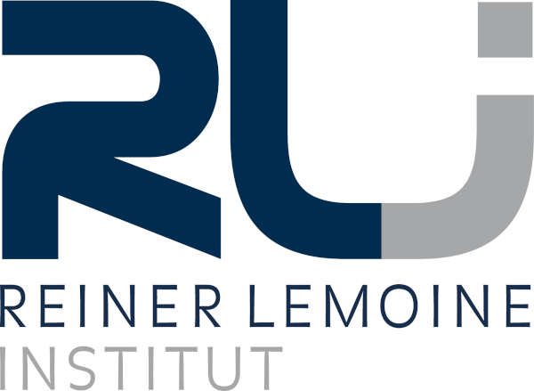

Willkommen!
===========
EmPowerPlan ist ein Stakeholder-Empowerment-Tool (StEmp-Tool) für die Region Oderland-Spree.
Es wurde vom [Reiner Lemoine Institut (RLI)](https://reiner-lemoine-institut.de/) im Projekt
[EmPowerPlan](https://reiner-lemoine-institut.de/projekt/empowerplan-regionale-planung-der-energiewende/)
ausgearbeitet. Es handelt sich um die Weiterentwicklung des
[DigiPlan Tools](https://reiner-lemoine-institut.de/digitaler-planungsatlas-anhalt-digiplan/).

In dieser Dokumentation finden Sie methodische und technische Hintergrundinformationen und
Anleitungen.

